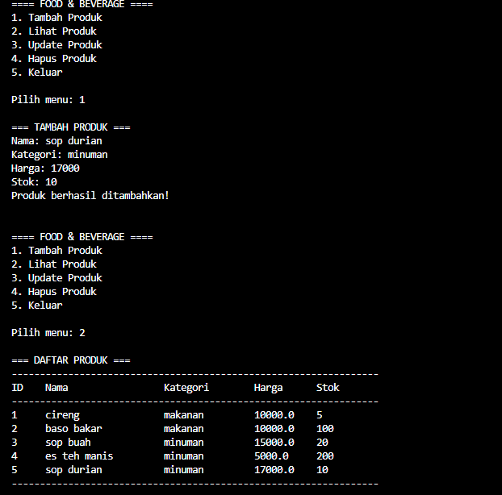

# 📦 Tugas UAS — Product Manager (Simple CLI)

A small, educational Python project to manage products with a minimal UI and a lightweight database module.

🚀 Quick highlights

- **Easy to extend:** Clear package layout for `model`, `database`, and `ui`.
- **CLI menu:** Basic console-driven UI in `ui/menu.py`.
- **Lightweight storage:** Database helpers in `database/db.py`.

🗂 Project structure

```
main.py
database/
    __init__.py
    db.py
model/
    __init__.py
    product.py
ui/
    __init__.py
    menu.py
docs/
    MANUAL.md
screenshots/  # add screenshots here
```

✅ Quick start

- Requirements: Python 3.8+
- From the project root run:

```powershell
python main.py
```

📝 Manual (in-repo)

- The full manual is kept at `docs/MANUAL.md`.
- You can edit that file to add step-by-step instructions, examples, and screenshots.

📸 Screenshot (placeholder)

 [Project Screenshot](screenshots/python2.png)

🔖 Manual quick link

- See the manual here: 📚 `docs/MANUAL.md`

💡 Development notes

- Keep database and generated files out of git (see `.gitignore`).
- If you add dependencies, add `requirements.txt` and list them.

🤝 Contributing

- Use feature branches and descriptive commits.

© Add a `LICENSE` file if you plan to publish this repository.

---

If you want me to add a sample screenshot file or commit these changes for you, tell me and I can run the git commands next.
